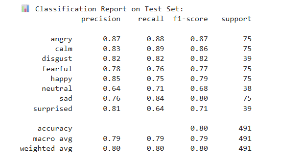
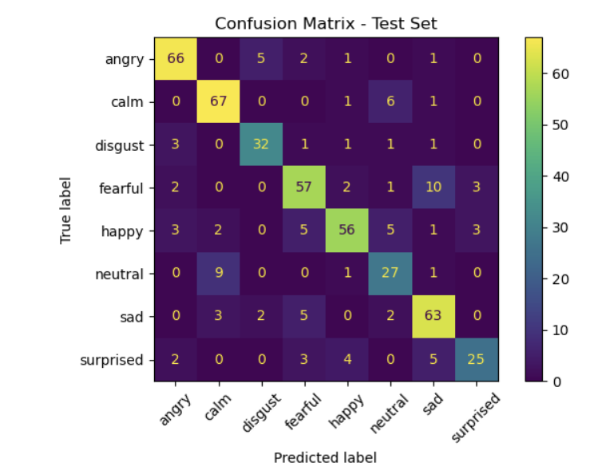
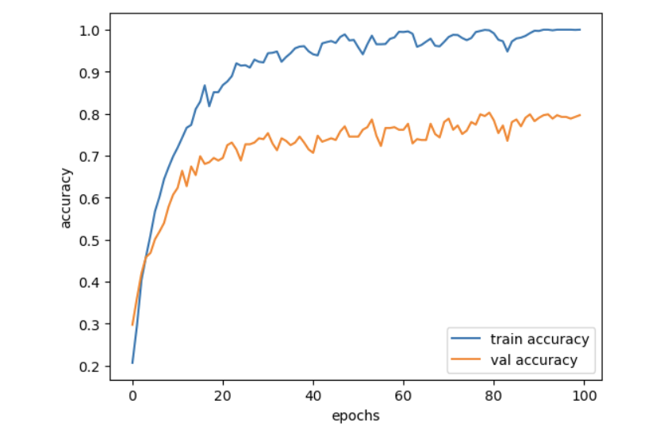
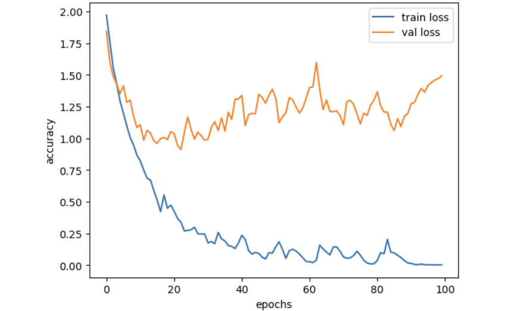

# Emotion Recognition from Speech using LSTM (TensorFlow)

This project focuses on building an end-to-end pipeline for **emotion classification from speech audio files** using deep learning techniques. Recognizing emotions conveyed through voice is essential for enhancing human-computer interaction, with practical applications in areas such as mental health monitoring, customer service automation, virtual assistants, and multimedia content analysis. The final model is based on a **Long Short-Term Memory (LSTM)** neural network trained with **TensorFlow/Keras**, and is deployed in a **Streamlit web application** that allows users to upload `.wav` files and receive real-time emotion predictions.
To achieve accurate emotion recognition, the system leverages advanced audio processing methods by extracting two complementary feature representations: Mel Spectrogram and Mel Frequency Cepstral Coefficients (MFCC). These features are combined into a 2-channel input, capturing both the temporal-frequency dynamics and perceptual characteristics of speech signals.


## Project Structure

emotion-speech-classifier/
│
├── mars project.ipynb                # Jupyter Notebook with full training pipeline
├── lstm_emotion_classifier.h5       # Trained TensorFlow/Keras LSTM model
├── scaler.pkl                        # Scaler for feature normalization (StandardScaler)
├── app_mars.py                       # Streamlit web app
├── test_app.py                       # Script for testing model with .wav input
├── requirements.txt                  # List of Python dependencies
├── demo.mp4                          # 2-minute demo video of the web app
└── README.md                         # Project documentation (this file)


## Project Overview

This project seeks to classify emotions from speech signals using **MFCC (Mel Frequency Cepstral Coefficients)** and a **TensorFlow-based LSTM model**.

Supported emotion classes:

- Neutral
- Calm
- Happy
- Sad
- Angry
- Fearful
- Disgust
- Surprised


## Preprocessing Workflow

### 1. Audio Preprocessing

- Input audio: `.wav` files
- Clip duration: \~3 seconds using `librosa.load(..., duration=3, offset=0.5)`
- Output: consistent shape for MFCC extraction

### 2. Feature Extraction using MFCC

- Extracted 40 MFCC features using `librosa`
- MFCC matrix padded to shape `(130, 40)` to standardize input size

  # Why MFCC + Mel Spectrogram?

- **Mel Spectrogram** captures the **temporal and frequency structure**, ideal for CNNs.
- **MFCC** mimics human auditory perception, emphasizing **emotion-relevant frequencies**.
- When used together:
  - Complement each other's strengths
  - Compact and noise-resistant
  - Proven effective in research for emotion detection tasks

### 3. Normalization and Label Encoding

- **StandardScaler** used for normalizing MFCCs → saved as `scaler.pkl`
- Emotion labels encoded to integers for model training


## Model Architecture (TensorFlow / Keras LSTM)

| Layer      | Details               |
| ---------- | --------------------- |
| Input      | Shape: (130, 40)      |
| LSTM 1     | 128 units             |
| Dropout    | 0.3                   |
| LSTM 2     | 64 units              |
| Dropout    | 0.3                   |
| Dense (FC) | 64 → 8 output classes |


### Overfitting & Optimization Strategies

Early training runs showed clear signs of **overfitting**. To address this, the following strategies were implemented:

- **Dropout Regularization**:
- Used  `Dropout` in dense layers
- Tuned dropout rate between **0.3**

  
### Training Parameters:

- Loss Function: `categorical_crossentropy`
- Optimizer: `Adam`
- Epochs: `100`
- Batch Size: `32`

## Evaluation Results

The model meets the accuracy criteria as per the project guidelines.

### Accuracy Metrics

| Metric            | Value |
| ----------------- | ----- |
| Overall Accuracy  | 80%   |
| F1 Score (macro)  | 79%   |
| Weighted F1 Score | 80%   |

### Per-Class Performance( classification)



### Confusion Matrix



### Training vs Validation Accuracy



### Training vs Validation Loss




## Streamlit Web App

### Run Locally:

```bash
streamlit run app_mars.py
```

### code
- Contains files related to training and testing the machine learning model
- mars project.ipynb: Jupyter Notebook containing the full training workflow, model architecture, and evaluation steps.
- app_mars.py: Best-performing trained model file.
- test_app.py: Python script for loading and testing the trained model, as well as evaluating on custom inputs or datasets.


### Features:

- Upload `.wav` file
- Hear playback in app
- See real-time emotion prediction


## Command-line Testing

To test a `.wav` file outside the app:

```bash
python test_app.py test1.wav
```

This will return the predicted emotion in the terminal.


## Dataset

- **RAVDESS** dataset- https://zenodo.org/records/1188976#.XCx-tc9KhQI
- Audio_Speech_Actors_1-24
- Audio_Song_Actors_1-24
- Audio files from 24 professional actors 
- Covers all 8 emotions
  

##  Reproducibility Steps
Follow these instructions to reproduce the training and evaluation of the voice emotion classification model:

1. Load the jupyter notebook file and install the requirements.
2. Download RAVDESS dataset and set correct folder path in notebook
3. Run `mars project.ipynb` to extract features, train model
4. Save model as `lstm_emotion_classifier.h5`
5. Save scaler as `scaler.pkl`
6. Use app or test script to predict on new audio files


## Demo Video

Demo video `demo.mp4` includes:

 [Click here to watch the demo](demo.mp4)


- Streamlit app launch
- Uploading a `.wav` file
- Playback and prediction demo
- Quick look at GitHub repo


## Author

Developed as part of a deep learning project on **emotion-aware audio classification** using TensorFlow and deployed via Streamlit.


Let us know if you found this helpful or wish to contribute!

